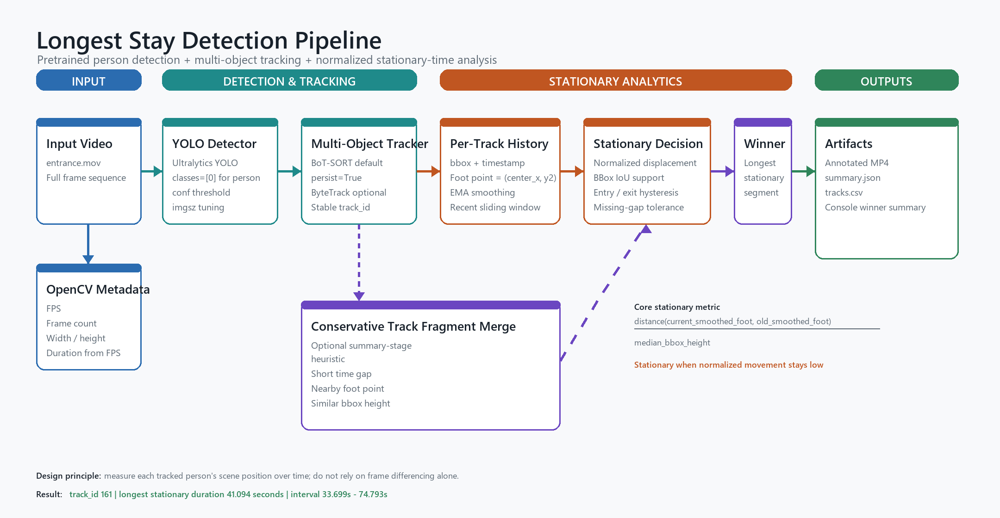
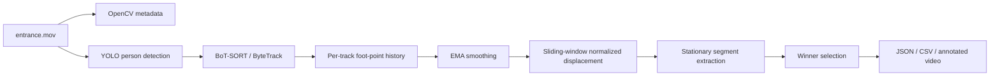

# Part 2: Method Design

## Pipeline





## Movement Measurement

For each tracked person:

```text
foot_point = ((x1 + x2) / 2, y2)
norm_disp = distance(current_smoothed_foot, old_smoothed_foot) / median_bbox_height
```

The bbox height normalization makes the threshold less sensitive to whether a person is near or far from the camera.

## Stationary Decision

A frame becomes a stationary candidate when:

- normalized displacement is below `--stationary-threshold`, or
- displacement is only slightly above threshold but bbox IoU remains high

Then hysteresis is applied:

- require at least `--min-stationary-sec` before starting a segment
- tolerate short movement/detection jitter before closing a segment
- allow short missing detections before splitting a segment

## Why This Approach

This problem is about persistent per-person position, so tracking is more suitable than frame differencing alone. Frame differencing can fail when a person stands still long enough to be absorbed into a background model, and it does not preserve identity across frames.
